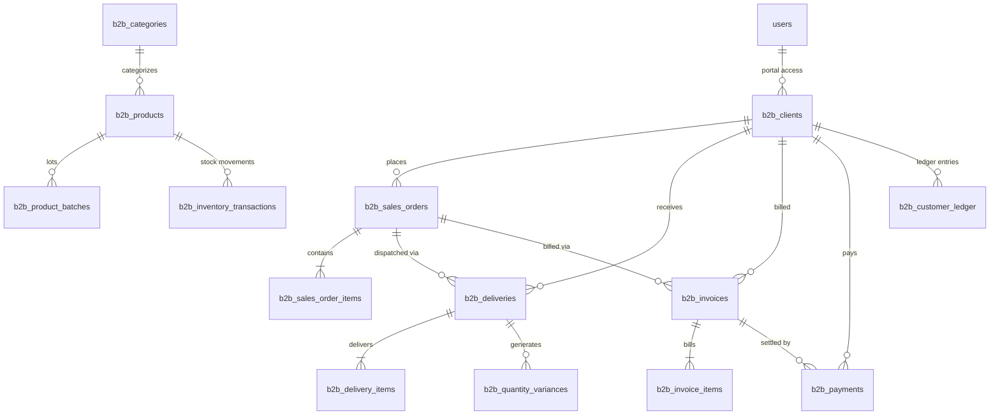

# 🏛️ B2B Enterprise Database Specification & ERD

**Target Database:** MySQL 8.0+ / MariaDB 10.5+ (Hostinger Compatible)  
**Storage Engine:** InnoDB  
**Character Set:** utf8mb4 / utf8mb4_unicode_ci  
**Transaction Isolation:** READ COMMITTED / REPEATABLE READ  

---

## 1. Core Architectural Principles

1. **Non-Destructive Migrations**: All migrations use additive definitions (`CREATE TABLE IF NOT EXISTS`, `ALTER TABLE ... ADD COLUMN IF NOT EXISTS`).
2. **Immutable Financial Records**: Historical invoices, posted payments, customer AR ledgers, and inventory movement logs cannot be updated or deleted directly. Corrective actions require separate credit/debit adjustments.
3. **Strict Quantity Separation**:
   - `ordered_qty`: Contractual customer order volume.
   - `delivered_qty`: Actual physical count dispatched from warehouse.
   - `variance_qty`: Computed as `delivered_qty - ordered_qty`.
   - `billable_qty`: Quantity approved for customer invoicing.
   - `foc_qty`: Approved Free-Of-Charge excess / bonus quantity.
   - `invoiced_qty`: Quantity billed on official tax invoice.
4. **Physical vs. Financial Separation**:
   - **Physical Inventory Deduction** = Strictly actual `delivered_qty` (e.g. `-1,100`).
   - **Billing Valuation** = Strictly approved `billable_qty` (e.g. `1,000 × ₱100 = ₱100,000`).

---

## 2. Entity Relationship Diagram (ERD)

---

## 3. Database Table Definitions

### `b2b_clients`
- `id`: INT PRIMARY KEY AUTO_INCREMENT
- `client_code`: VARCHAR(50) UNIQUE NOT NULL (e.g. `CLI-001`)
- `company_name`: VARCHAR(255) NOT NULL
- `tin_number`: VARCHAR(50) NULL
- `contact_person`: VARCHAR(255) NOT NULL
- `email`: VARCHAR(255) NOT NULL
- `phone`: VARCHAR(50) NOT NULL
- `billing_address`: TEXT NOT NULL
- `delivery_address`: TEXT NOT NULL
- `credit_limit`: DECIMAL(15,2) DEFAULT 0.00
- `payment_terms`: VARCHAR(50) DEFAULT '30 Days'
- `credit_status`: ENUM('Good', 'Warning', 'Blocked') DEFAULT 'Good'
- `credit_control_action`: ENUM('Block Order', 'Require Approval', 'Allow Order') DEFAULT 'Require Approval'
- `current_balance`: DECIMAL(15,2) DEFAULT 0.00
- `is_active`: TINYINT(1) DEFAULT 1

### `b2b_products`
- `id`: INT PRIMARY KEY AUTO_INCREMENT
- `sku`: VARCHAR(100) UNIQUE NOT NULL
- `product_name`: VARCHAR(255) NOT NULL
- `description`: TEXT NULL
- `category_id`: INT NULL (FK -> `b2b_categories`)
- `category_name`: VARCHAR(100) DEFAULT 'Cosmetics'
- `unit_of_measure`: VARCHAR(50) DEFAULT 'piece'
- `unit_price`: DECIMAL(15,2) DEFAULT 0.00
- `cost_price`: DECIMAL(15,2) DEFAULT 0.00
- `current_stock`: INT DEFAULT 0
- `minimum_stock`: INT DEFAULT 10

### `b2b_sales_orders` & `b2b_sales_order_items`
- Tracks full order lifecycle with explicit quantity separation: `ordered_qty`, `delivered_qty`, `variance_qty`, `billable_qty`, `foc_qty`, `invoiced_qty`.

### `b2b_deliveries` & `b2b_delivery_items`
- Physical warehouse dispatch records and batch/lot allocation.

### `b2b_quantity_variances`
- Automated over/under-delivery detection, classification (`Production Overrun`, `FOC`, `Replacement`), and manager approval records.

### `b2b_invoices` & `b2b_invoice_items`
- Billing invoices calculated strictly from approved **Billable Quantities**.

### `b2b_payments`
- Payment collection records and automated invoice allocation.

### `b2b_customer_ledger`
- Immutable double-entry accounts receivable sub-ledger with running balances.

### `b2b_inventory_transactions`
- Immutable physical inventory movements matching actual delivered quantities.

### `b2b_audit_logs`
- Append-only security audit trail with before/after JSON snapshots.
